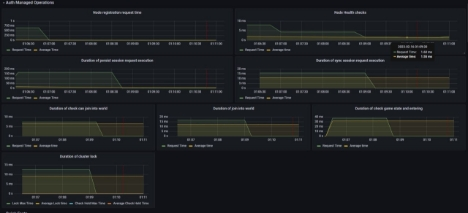

# **Rpc Module**
## **Описание**
Библиотека rpc для межсервисного взаимодействия по TCP протоколу.

Основные функции:

1. Отправка non-blocking запросов для получения результата с течением времени.
2. Распределенные блокировки.
3. Сериализация данных Kryo5

## **Стек**
- Netty
- JDK 21

## **How To**
### **Определение конфигурации**
Общий блок конфигурации выглядит следующим образом где определяются параметры подключения/ресурсов сервера входящих подключений (**inbound**) или исходящих подключений к удаленному сервису (**outbound**)

```yaml
server:
 sync:
    transport: EPOLL
    resources:
     lock-lease-timeout: 300000
    inbound:
     host: 192.168.0.204
     port: 7000
     login: root
     password: qweasd123
    outbound:
     - service: server-health-check-3
       login: root
       password: qweasd123
       connections: 1
       timeout: 500
       initialize-mode: ON_CONNECT
```


|**Параметр**|**Возможные значения/тип**|                                                                                                                                                                                                                                                                                                                                                                                                                                                                                                                                                                                  **Описание**                                                                                                                                                                                                                                                                                                                                                                                                                                                                                                                                                                                  |
| :-: | :-: |:------------------------------------------------------------------------------------------------------------------------------------------------------------------------------------------------------------------------------------------------------------------------------------------------------------------------------------------------------------------------------------------------------------------------------------------------------------------------------------------------------------------------------------------------------------------------------------------------------------------------------------------------------------------------------------------------------------------------------------------------------------------------------------------------------------------------------------------------------------------------------------------------------------------------------------------------------------------------------------------------------------------------------------------------------------------------------------------------------------------------------------------------------------------------------:|
|transport|NIO, KQUEUE, EPOLL (str)|                                                                                                                                                                                                                                                                                                                                                                                                                                                                                                                                                                                 Типы селектора                                                                                                                                                                                                                                                                                                                                                                                                                                                                                                                                                                                 |
|resources.lock-lease-timeout|any positive (long)|                                                                                                                                                                                                                                                                                                                                                                                                                                                                                                                                           стандартное время сброса блокировки в миллисекундах, срабатывает в случаях если блокировку                                                                                                                                                                                                                                                                                                                                                                                                                                                                                                                                           |
|inbound||                                                                                                                                                                                                                                                                                                                                                                                                                                                                                                                                                                           блок входящий подключений                                                                                                                                                                                                                                                                                                                                                                                                                                                                                                                                                                            |
|outbound||                                                                                                                                                                                                                                                                                                                                                                                                                                                                                                                                                                           блок исходящих подключений                                                                                                                                                                                                                                                                                                                                                                                                                                                                                                                                                                           |
|outbound.service|any (str)|                                                                                                                                                                                                                                                                                                                                                                                                                                                                                                                           идентификатор сервиса (см. SyncServiceAspectBinderSupport#execute), определяет конфигурацию для вызова удаленной операции                                                                                                                                                                                                                                                                                                                                                                                                                                                                                                                            |
|outbound.enabled|true, false (bool)|                                                                                                                                                                                                                                                                                                                                                                                                                                                                                                                                                                    включает/отключает логику взаимодействия                                                                                                                                                                                                                                                                                                                                                                                                                                                                                                                                                                    |
|outbound.login/password|any (str)|                                                                                                                                                                                                                                                                                                                                                                                                                                                                                                                                                           учетные данные сервиса, если есть (inbound.login/password)                                                                                                                                                                                                                                                                                                                                                                                                                                                                                                                                                           |
|outbound.connections|any positive (int)|                                                                                                                                                                                                                                                                                                                                          <p>кол-во соединений в пуле. Не рекомендуется использовать большое количество, оптимальное значение для любых задач варьируется - 5-10, меньше/больше - происходит деградация производительности, также нужно учитывать что Direct/Selector не резиновый и таких сервисов может быть множество + дополнительные открытые сокеты БД/etc.</p><p>- соединения переиспользуются</p><p>- соединения на каждый запрос перебирается методом Round Robin</p><p>- занятость канала не проверяется</p>                                                                                                                                                                                                                                                                                                                                          |
|outbound.timeout|any positive (long, milleseconds), -1 - special option|                                                                                                                                                                                                                                                                                                                                                                                                                                                       <p>таймаут получения ответа от сервиса, стандартно 60 с</p><p>- hashed wheel timer</p><p>- <https://en.wikipedia.org/wiki/Circular_buffer></p><p>Спец. значения <br>-1 определяет конфигурацию сервиса в режиме ACK-FORGET<br>`  `0 применяется стандартно 60с</p>                                                                                                                                                                                                                                                                                                                                                                                                                                                       |
|outbound.lock-lease-timeout|any positive (long, milleseconds)|                                                                                                                                                                                                                                                                                                                                                                             <p>таймаут высвобождения распределённого блокировки. Если по какой-либо причине не был обработан ручной запрос разблокировки, блокировка автоматически высвобождается после истечения времени, указанного в этом параметре</p><p>- не является приоритетней чем, ручная передача значения в методы<br>  **ClusterSyncLock#tryLockAsync(long, long, long)**<br>  **LocalSyncLock##tryLockAsync(long, long, long)**</p>                                                                                                                                                                                                                                                                                                                                                                              |
|outbound.initialize-mode|ON\_CONNECT, ON\_START| <p>тип инициализации подключения</p><p>- **ON\_CONNECT** - при подключении смежного сервиса к текущему<br>  как это работает (см. **ClusterServerManagermentSyncService**)<br>      1. Подключаемый сервис должен отправить отправляет пакет **RegisterNodeMessage**, в котором передает свою информацию<br>  2. При получении данных, сервис принимающий данные должен нотифицировать контекст о подключаемом сервисе событием **SyncServiceConnectedEvent**, где указывает какой **outbound.service** необходимо инициализировать c передачей параметров - **идентификатор сервиса/класс-прокси сервиса/хост подключенного сервиса/порт подключенного сервиса**</p>applicationEventPublisher.publishEvent(SyncServiceConnectedEvent.build(ClusterSessionService.class,SharedServiceNames.GAME_SESSION_CLUSTER + serverId, gameServer.getSyncHost(), gameServer.getSyncPort()));<p>&emsp;3\. Контекст, получив событие **SyncServiceConnectedEvent,** инициализирует соединения для этого сервиса</p><p>- **ON\_START** - при старте сервиса, подключения инициализируются сразу по событию контекста **ApplicationStartedEvent**</p> |
###
### **Примеры прокси-сервисов (код)**
****Ахтунг**

- Для выполнения какой-либо дополнительной логики сервиса через **поток CompletableFuture**,
  необходимо использовать **ВЫДЕЛЕННЫЙ** пул потоков.
  В частности, **активно использовать** для вызова методов из **LocalSyncLock/**любой другой логики обработки результата-вызовов, вместо использования commonPool.
- Нельзя использовать методы блокирующие выводы результата - **CompletableFuture#**get(), **CompletableFuture#**get(long, TimeUnit), рискуем заблокировать потоки селектора.
  Поэтому нужно строить свою логику потоком операций **CompletableFuture. (тут где-то должна была быть штука про каскад Callable)**
  пы.сы. возможно к фьючам добавиться поддержка реактивных стримов (ждем релиза loom и принимаем решение о расширении возможностей или нет)

**Пример кода сервиса**

```java
/**
* 1) Синхронные запросы не поддерживаются, тип предполгаемого ответа должен быть обернут в CompletableFuture.
* 2) Все аргументы в т.ч. результирующие объекты должны быть доступны к сериализации
* 3) Интерфейс сервиса должен иметь реализацию на стороне отправителя
*    - dummy методами или пробросом ошибки UnsupportedOperationException для корректного наложения прокси объекта
*    - аннотацией @ConnectableSyncService, где обязательный аргумент, это идентификатор используемой конфигурации сервиса
*    - аннотациями DI для их инъекции в остальные сервисы/компоненты
*/

public interface SampleService extends LockSupport {

 	 /**
 	  * @return CompletableFuture<Void> - отправить запрос/завершить выполнении оперции с результатом null
 	  */
 	 CompletableFuture<Void> ackForget(String foo, SomeSerializablePayload bar);

 	 /**
 	  * void - аналогично предыдущему методу
 	  */
 	 void ackForget(String foo, SomeSerializablePayload bar);
	  
 	 /**
 	  * отправить запрос/получить результат с течением времени
 	  */
 	 CompletableFuture<SomeSerializableResponse> ackReceive(SomeSerializablePayload bar);
	  
 	 /**
 	  * отправить запрос в "динамический сервис" (должен быть определен в блоке 'outbound')/получить результат с течением времени
 	  */
 	 ComplatebleFuture<SomeSerializableResponse> ackReceiveAny(@ServiceId String serviceId, SomeSerializablePayload bar);

}
```

### **Расширение - распределенные блокировки операций**
Для работы с блокировками, необходимо расширить интерфейс прокси-сервиса классом -  **org.genfork.rpc.lock.LockSupport**

Логика блокировки аналогична **ReentrantLock**, с доработками для асинхронного взаимодействия. Под катом используются атомарные операции доступа к состоянию блокировки, что гарантирует эксклюзивную блокировку в рамках всего кластера по запросу ключа.

См.

- org.genfork.rpc.lock.ClusterSyncLock - реализация для отправителя (запрос блокировки)
- org.genfork.rpc.lock.LocalSyncLock - реализация для получателя (обработка и проверка состояния блокировки)
- org.genfork.rpc.lock.SyncLockValue - объект состояния блокировки
- org.genfork.rpc.lock.LockRegistry - хранилище объектов блокировок, очищается только по завершению работы сервиса

**Распределенные блокировки (пример)**

```java
public interface LockSupport {

 	 /**
 	  * Получить блокировку по идентификатору "динамического" сервиса и ключу блокировки
 	  */
 	 default ClusterSyncLock getLock(@ServiceId String serviceId, String entry) {
 		 throw new UnsupportedOperationException();
 	 }

 	 /**
 	  * Получить блокировку по ключу блокировки
 	  */
 	 default ClusterSyncLock getLock(String entry) {
 		 throw new UnsupportedOperationException();
 	 }
}
```


**Пример взаимодействия с блокировками (сервис-отправитель)**

```java
          final String lockEntry = "f_lock:" + foo;

 		 // инициализация объекта блокировки

 		 final ClusterSyncLock syncLock = connectableSyncService.getLock(lockEntry);

 		 // не использовать в реальной логике, идентификаторы потоков внутри одного процесса имеют колизии, альтернатива - Rnd.get(seed) или атомарные счетчики

 		 final int lockerId = Thread.currentThread().getId();
		  
 		 // попытка захватить блокировку с ожидание в 5с и захватом блокировки на 60с (по истечению таймаута будет выброшена ошибка RemoteServiceTimeoutException

 		 final CompletableFuture<Boolean> tryLockFuture = syncLock.tryLockAsync(lockerId, 5000, 60_000);
 		 tryLockFuture.whenComplete((locked, err) -> {
 			 if (err) {
 				 throw new ...;
 			 }
			  
 			 if (!locked) {
 				 // do somethings
 				 return;
 			 }
			  
             // снять блокировку по завершению операции
 			 syncLock.unlockAsync(lockerId);
 		 });
```

**Пример взаимодействия с блокировками (сервис-получатель)**

```java
        final String lockEntry = "f_lock:" + foo;

 		 // получить локальное состояние блокировки

 		 final LocalSyncLock lock = lockRegistry.getLock(lockEntry);

 		 // проверить, захвачена ли блокирова по идентификатору lockerId
 		 lock
            .isHeldBy(lockerId)
            .handleAsync((heldByThread, th) -> {
		        // do somethings
 			 }, SchedulerFactory.getClusterPool());
```
         
## **Outbox ops**
Fail safe передача данных. Работает только для режима ACK-FORGET - методы отправки данных без результатов.

Включается аннотацией-маркером **@Outbox**. 
Требует реализацию **OutboxProcessor**, где осуществляется забор ошибочных запросов/удаление успешных и вставка ошибочных.

## **Метрики**
Для автоматического сбора метрик той или иной логики, метод сервиса помечается аннотацией @TimedOperation, где аргументами являются экспортируемые параметры таймера в Prometheus, которые в дальнейшем можно визуализировать в Grafana.

**Пример**

```java
@TimedOperation(operation = "gameservice.olympiad.match-events", description = "Notify main server for current active world matches")
CompletableFuture<Void> notifyMatchEvents(@ServiceId String serviceId, List<SharedOlympiadMatchEventInfo> list);
```



